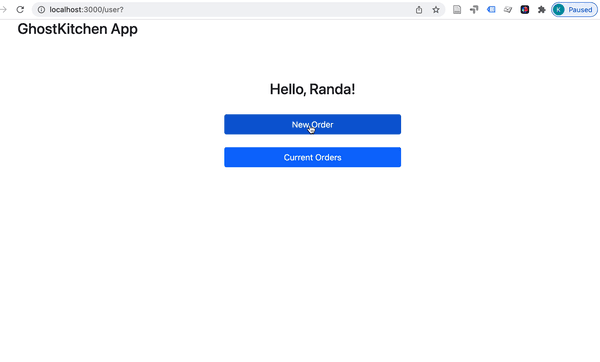

# GhostKitchen-III
**Team:** Katerina Bosko, Jiayi Li

In this project, we implement a database for a restaurant chain "Golden triangle" which has 5 locations across several U.S. states. The company wants to try out the new business model - ghost kitchen - meaning that the restaurants can create "virtual brands" without providing in-dining options and customers order the new menu items for takeout, drive-through and delivery only. The advantages of this model is that the restaurants can save costs, experiment with new menus and create in-house analytics.

This is the continuation of our projects ["GhostKitchen"](https://github.com/Jiayi-Emily-Li/GhostKitchen) and ["GhostKitchen-II"](https://github.com/k-bosko/GhostKitchen-II) that were implemented with SQLite and MongoDB accordingly.

Here we rewrote the queries such that they work with **Redis** database. 

## App


**GhostKitchen app**  was implemented using Express framework for Node.js, Redis and Bootstrap.

## Using the app

1) Clone the repo and cd into `GhostKitchen-III/app/` 
2) Install the dependencies

```
npm install
```

3) Start Redis server locally 
```
redis-server /usr/local/etc/redis.conf
```

4) Import database into your Redis local instance by running 

```
npm run prepopulate
```

5) Start the server

```
npm start
```

6) Point your browser to http://locahost:3000
## Database Design
To create a Redis database, we went through the whole database creation cycle:

1. Analyzing business requirements
2. Conceptual modeling
3. Logical modeling using Redis data structures
4. Migrating from SQL format to JSON format 
5. Importing JSON files in Redis
6. Rewriting the queries using Redis commands

### Conceptual Model
We selected Order, Customer, Location, Meal, Brand, and Pickup Type to be used as in-memory key-value storages.


# Work Distribution
Jiayi Li worked on creating the Admin page and CRUD Meals and view all Orders.

Katerina Bosko worked on creating th User page and CRUD Orders and view user's Orders.

# Acknowledgement
The data for customers collection was generated using [ https://www.mockaroo.com/](https://www.mockaroo.com/)

This is a project for a Database Management Systems class at Northeastern University (Silicon Valley campus) taught by [John Alexis Guerra Gómez](https://github.com/john-guerra)
